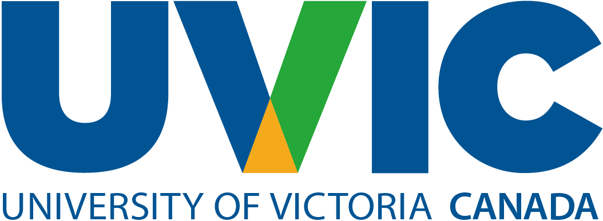
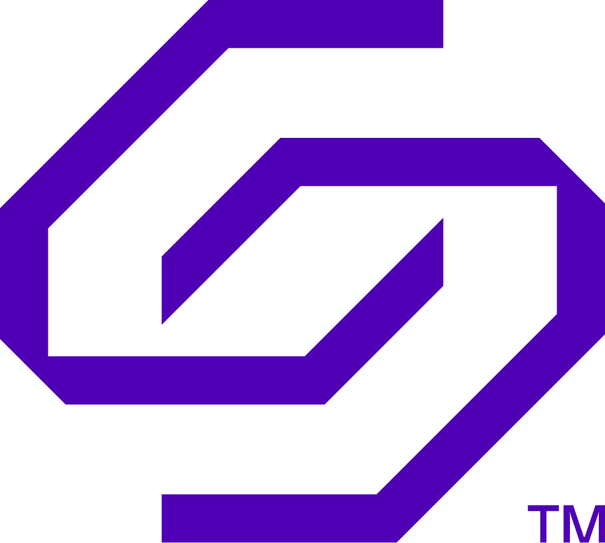
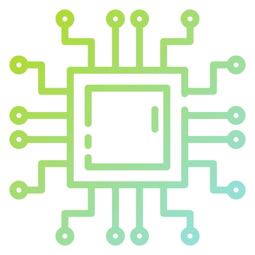
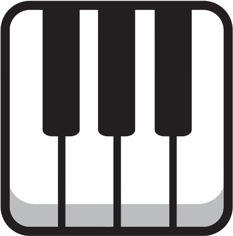
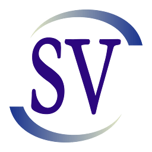
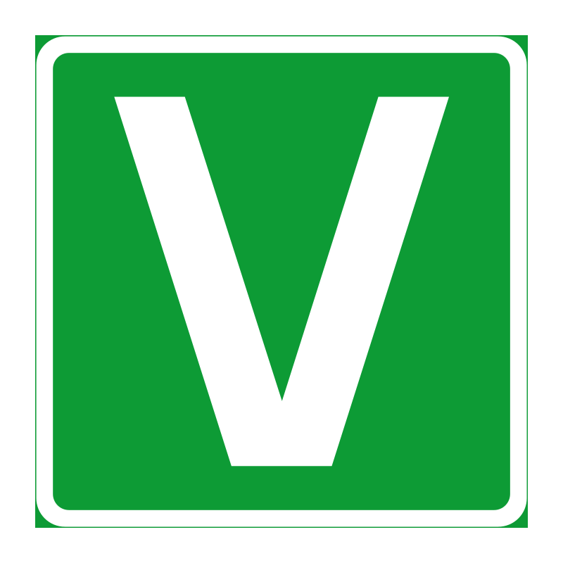
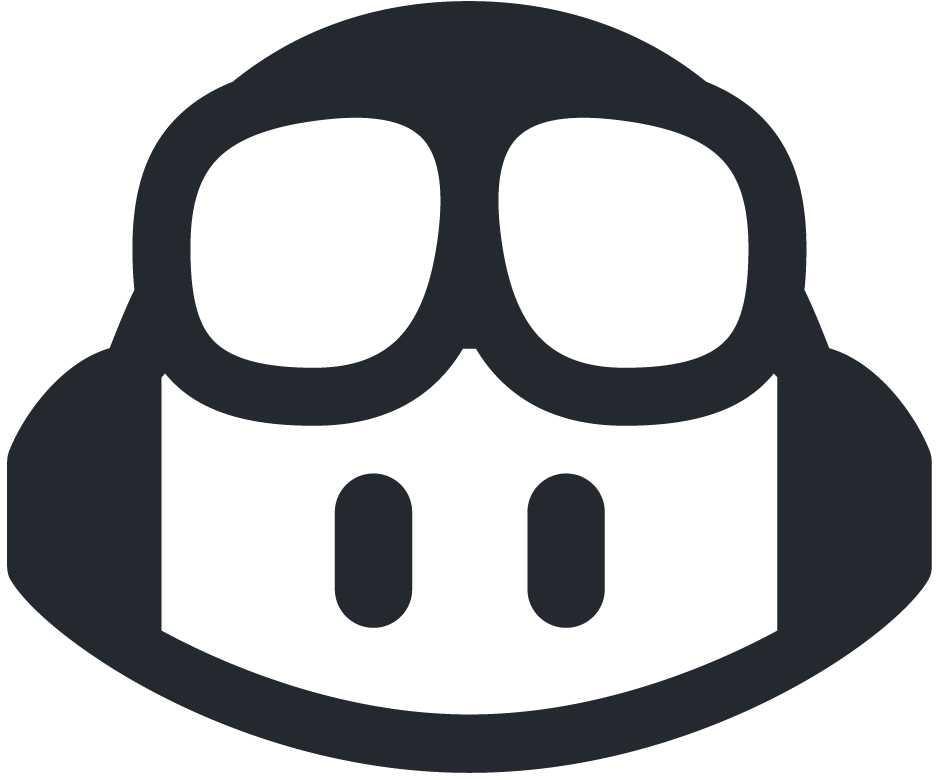
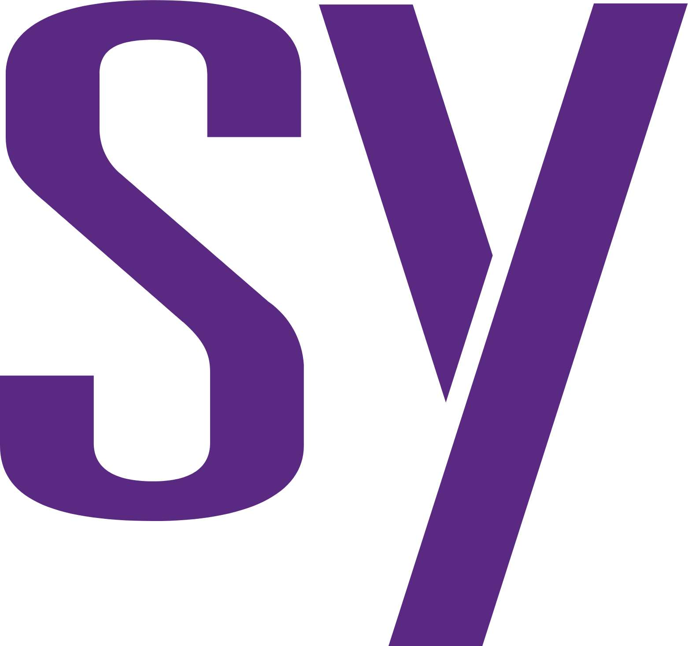

<h3 align="center">Let's Connect</h3>

## 

My name is Gawah Chong-Simard. I study Computer Engineering at the University of Victoria. 

My current focus is on ASIC, FPGA, and SoC design with an emphasis on design verification with UVM.

- **Studying:** Computer Engineering at the University of Victoria 
- **Working:** SoC DV Engineer at Solidigm (Co-op)
- **Exploring:** VLSI, digital design, design verif 
- **Fun fact:** I work the best while listening to classic music, especially: Chopin, Scriabin, Rachmaninoff, Prokofiev, Liszt and Tchaikovsky. 

## 

<table align="center" cellpadding="8" cellspacing="0">
  <tr>
    <td align="center" width="150">
      
    </td>
    <td align="center" width="150">
      
    </td>
    <td align="center" width="150">
      
    </td>
    <td align="center" width="150">
      
    </td>
    <td align="center" width="150">
      
    </td>
  </tr>
  <tr>
    <td align="center">SystemVerilog</td>
    <td align="center">Python</td>
    <td align="center">C++</td>
    <td align="center">C</td>
    <td align="center">VHDL</td>
  </tr>
</table>

## 

- **SystemVerilog and UVM** for verification and design
- **Synopsys VCS and Verdi** for simulation and debug/analysis

## 

<table>
  <tr>
    <td align="center" width="150">
      
       Linux
    </td>
    <td align="center" width="150">
      
       VS Code
    </td>
    <td align="center" width="150">
      
       GitHub Copilot
    </td>
    <td align="center" width="150">
      
       Git
    </td>
    <td align="center" width="150">
      
       Synopsys
    </td>
  </tr>
</table>

